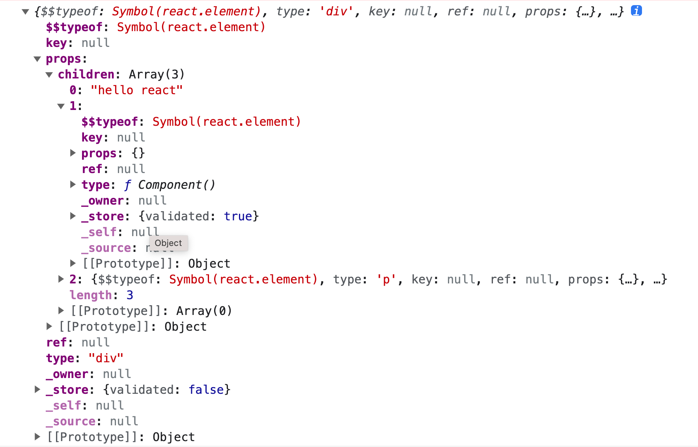
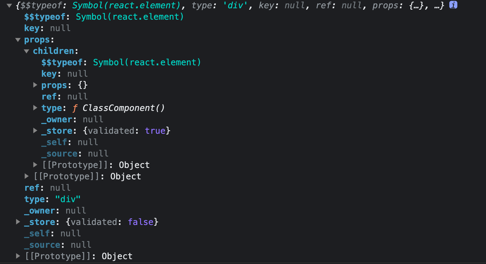
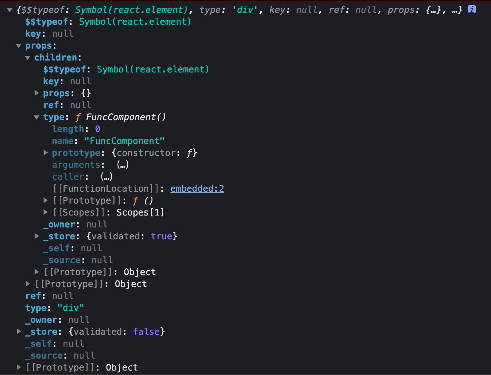
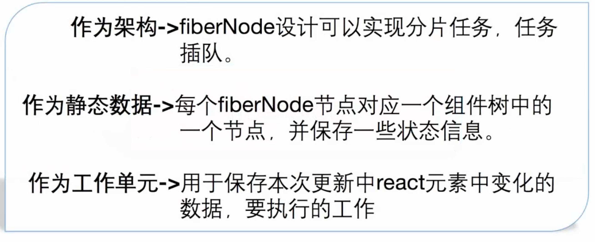

# Fiber 架构

## 学习路径


## 高频面试题

### 为什么需要 React Fiber 架构？它解决了什么问题？

### Fiber 节点有哪些重要的属性？他们有什么作用？

### 是否可以将虚拟 DOM 树，直接替换成 Fiber 树？为什么？

## fiber 原理

### React 中有哪些节点类型？

1. react 元素

2. 组件（函数组件、类组件）

3. fiberNode， 即组成 fiber 架构的节点

### react 元素，即 createElement 返回的结果

案例

```html
<html>
  <head>
    <script src="https://unpkg.com/react@16/umd/react.development.js"></script>
    <script src="https://unpkg.com/react-dom@16/umd/react-dom.development.js"></script>
    <script src="https://lib.baomitu.com/babel-core/5.8.38/browser.min.js"></script>
  </head>
  <body>
    <script type="text/babel">
      const Component = () => <div>study react</div>

      const reactEle = (
        <div>
          hello react
          <Component></Component>
          <p>
            <span>good</span>  
          </p>
        </div>
      )

      console.log(reactEle)
    </script>    
  </body>
</html>
```



注意点：

1. `$$typeof` 属性代表节点的类型

2. `type` 属性

- 如果是 html 原生标签，type属性为html标签的tag
- 如果为react组件，则为该组件对应的函数。由此可以看出在构建阶段，reactElement并不是完整的树，而需要执行组件对应的函数才能构建出完整的树。这也是babel为什么在编译期可以进行编译的原因，不需要编译到子组件里面有什么，**因此babel只会处理当前文件的**

### 组件，即类组件、函数组件

#### 类组件

案例1

```html
<html>
  <head>
    <script src="https://unpkg.com/react@16/umd/react.development.js"></script>
    <script src="https://unpkg.com/react-dom@16/umd/react-dom.development.js"></script>
    <script src="https://lib.baomitu.com/babel-core/5.8.38/browser.min.js"></script>
  </head>
  <body>
    <script type="text/babel">
      class ClassComponent extends React.Component {
        render() {
          return (
            <div>study react</div>
          )
        }
      }

      const componentNode = <div><ClassComponent></ClassComponent></div>

      console.log(componentNode)
    </script>    
  </body>
</html>

```



案例2

```html
<html>
  <head>
    <script src="https://unpkg.com/react@16/umd/react.development.js"></script>
    <script src="https://unpkg.com/react-dom@16/umd/react-dom.development.js"></script>
    <script src="https://lib.baomitu.com/babel-core/5.8.38/browser.min.js"></script>
  </head>
  <body>
    <div id="root"></div>
    <script type="text/babel">
      class ClassComponent extends React.Component {
        render() {
          return (
            <div>study react</div>
          )
        }
      }

      console.log(ClassComponent)

      ReactDOM.render(<ClassComponent></ClassComponent>, document.getElementById('root'))
    </script>    
  </body>
</html>

```

> 问题
> 如果没有继承 `ReactComponent` 而是使用一个普通的类，会有什么问题？
> 是因为react内部会进行一个原型上的isReactComponent的属性判断

会出现以下错误


因此做以下尝试

```html
<html>
  <head>
    <script src="https://unpkg.com/react@16/umd/react.development.js"></script>
    <script src="https://unpkg.com/react-dom@16/umd/react-dom.development.js"></script>
    <script src="https://lib.baomitu.com/babel-core/5.8.38/browser.min.js"></script>
  </head>
  <body>
    <div id="root"></div>
    <script type="text/babel">
      function FunctionComponent() {

      }

      FunctionComponent.prototype = new React.Component()
      FunctionComponent.prototype.isReactComponent = {}
      FunctionComponent.prototype.render = () => {
        return <div>study react</div>
      }

      ReactDOM.render(<FunctionComponent></FunctionComponent>, document.getElementById('root'))
    </script>    
  </body>
</html>

```

```html
<html>
  <head>
    <script src="https://unpkg.com/react@16/umd/react.development.js"></script>
    <script src="https://unpkg.com/react-dom@16/umd/react-dom.development.js"></script>
    <script src="https://lib.baomitu.com/babel-core/5.8.38/browser.min.js"></script>
  </head>
  <body>
    <div id="root"></div>
    <script type="text/babel">
      class ClassComponent {
        constructor() {
          this.state = {}
        }

        render() {
          return <div>study react</div>
        }
      }

      ClassComponent.prototype.isReactComponent = {}

      ReactDOM.render(<ClassComponent></ClassComponent>, document.getElementById('root'))
    </script>    
  </body>
</html>

```

#### 函数组件

案例

```html
<html>
  <head>
    <script src="https://unpkg.com/react@16/umd/react.development.js"></script>
    <script src="https://unpkg.com/react-dom@16/umd/react-dom.development.js"></script>
    <script src="https://lib.baomitu.com/babel-core/5.8.38/browser.min.js"></script>
  </head>
  <body>
    <script type="text/babel">
      const FuncComponent = () => <div>study react</div>

      const componentNode = <div><FuncComponent></FuncComponent></div>

      console.log(componentNode)
    </script>    
  </body>
</html>

```




#### react 执行组件的逻辑


### 虚拟DOM

案例

```html
<html>
  <head>
    <script src="https://unpkg.com/react@16/umd/react.development.js"></script>
    <script src="https://unpkg.com/react-dom@16/umd/react-dom.development.js"></script>
    <script src="https://lib.baomitu.com/babel-core/5.8.38/browser.min.js"></script>
  </head>
  <body>
    <div id="root"></div>
    <script type="text/babel">
      function Component (props) {
        return <React.Fragment>{props.children}</React.Fragment>
      }
      const virtualDom = React.createElement(Component, { children: ['hello world'] })

      ReactDOM.render(virtualDom, document.getElementById('root'))
    </script>    
  </body>
</html>

```

#### jsx 转 虚拟 dom 原理


#### 虚拟dom树结构


### fiberNode，即组成 fiber 架构的节点

#### React Fiber 的概念

Fiber 是继虚拟DOM之后用另一种方式来表达真实DOM的抽象信息，通过`链表`的方式来建立父、子、兄弟节点之间的关系，其主要解决`分片渲染`和`优先级调度`等核心问题

#### fiber 树结构


- Root Fiber 对应的是整个应用的`根DOM节点`，即id='root'的dom节点
- alternate 指向需要比对的节点，例如新树指向老树，老树指向新树

与虚拟dom的区别

- 虚拟dom只有children属性，是单向的
- fiber 会执行组件得到组件的返回值为子节点，而虚拟dom只会到组件级别，组件的子节点需等运行时得到

#### fiber 节点的分类

1. fiberRoot

fiberRoot 是整个应用的根节点，相当于整棵fiber树的大脑。一方面作为存储载体，它记录了整个fiber树的调度状态，以及渲染状态，更重要的是可以控制老fiber树和新fiber树的切换，从而达到双缓冲的效果。

双缓冲可以理解为一边渲染一边diff（TODO：还需要深入学习理解）


2. rootFiber

代表 root 容器对应的 fiber 节点，作为渲染树的入口节点

3. fiberNode




TODO: stateNode 需要更深入看下

## DOM树的构建流程


### 为什么不直接舍弃虚拟dom？而是先构建虚拟dom，再通过虚拟dom构建fiber

如果直接舍弃，对原来的代码侵入性太大，兼容不了旧项目，因为旧项目可能使用createElement()这种方式来写的。因此选择对原有的进行扩展，开闭原则
