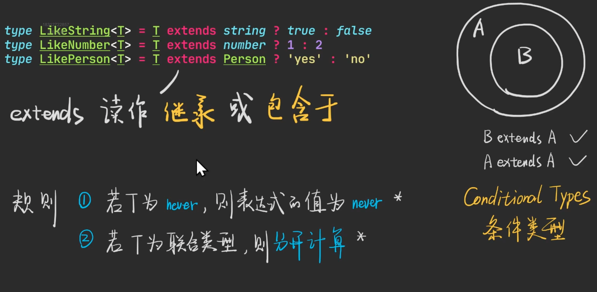

# 深入学习-2022-09-14

## 第一节：数据类型

### 一、JS与TS的类型

#### JS datatype
1. null
2. undefined
3. string
4. number
5. boolean
6. bigint
7. symbol
8. object(Funtion/Array/Date...)

#### ts datatype
1. 以上所有，加上
2. void
3. never
4. enum
5. unknown
6. any
7. 自定义类型 type/interface


### 二、使用TS描述JS的类型

#### 如何理解TS的数据类型

以**集合**的角度理解TS数据类型

#### 如何在TS里描述对象的数据类型？

1. 用 class/constructor 描述
```typescript
const a: Function = () => 1
const b: Array<string> = ['12', '345']
const c: Date = new Date()
```

2. 用 type 或 interface 描述
```typescript
type A = {
  name: string
  age: number
}
const e: A = {
  name: 'ys',
  age: 234
}

type B = {
  // 索引签名，k可以为任意值。k的类型可以为 string | number | Symbol
  [k: string]: number
}
const f: B = {
  age: 234,
  hh: 435
}

// 使用 Record 泛型，与上面完全等价
type B1 = Record<string, number>
const g: B1 = {
  age: 234,
  hh: 435
}
```
> 结论： 由于Object太不精确，所以TS开发者一般使用`索引签名`或者`Record泛型`来描述普通对象

#### 数组对象，该怎么描述
用`[]`和`Array泛型`描述

```typescript
type A = string[]
const a: A = ['345', 'dfg']

// 等价

type B = Array<string>
const b: B = ['345', 'dfg']
```

```typescript
// 元组类型
type D = [string, string, string]
const d: D = ['345', 'dfg', 'dfgfg']
const e: D = ['345', '345'] // 报错
```

> 结论：由于Array太不精确了，所以TS开发者一般使用，`Array<?>`或`string[]`或`[string, number]`来描述数组


#### 函数对象，该怎么描述？

```ts
type FnA = (a: number, b: number) => number
// ！！！接收的参数能少不能多
const a: FnA = () => {
  return 123
}
// ！！！调用的时候必须按照声明来传参数
a() // 报错
a(345) // 报错
a(13, 234)

const b: FnA = (x, y) => {
  return x + y
}
```

```ts
type FnReturnVoid = () => void
type FnReturnUndefined = () => undefined

const f1: FnReturnVoid = () => {
  console.log(123)
}

// 报错，上面声明的FnReturnUndefined 的返回值是undefined。就必须显式的返回undefined
const f2: FnReturnUndefined = () => {
  console.log(123)
  // 加上此句return 才不会报错
  // return undefined

  // return null 也不会报错？？？？TODO
  // return null
}
```

带有this的函数声明
```ts
type Person = {
  name: string
  age: number
  sayHi: FnWithThis
}

type FnWithThis = (this: Person, name: string) => void

// 报错，因为箭头函数的this是上下文中的this。
// const fn: FnWithThis = () => {
//   console.log('hi' + this.name)
// }
const fn1: FnWithThis = function () {
  console.log('hi ' + this.name)
}

const x: Person = {
  name: 'yusong',
  age: 19,
  sayHi: fn1
}
// 报错
// fn1("ys")

x.sayHi('123')
fn1.call(x, '123')
```

> 结论：由于 `Function` 不太精确，所以开发者一般使用 `() => ?` 来描述函数


#### 其他对象

```ts
const d: Date = new Date()
const r: RegExp = /ab+c/
const r1: RegExp = new RegExp('ab+c')

const m1: Map<string, number> = new Map()
m1.set('345', 345)
const wm: WeakMap<{ name: string }, string> = new WeakMap()
wm.set({ name: 'ys' }, '68')

const s: Set<number> = new Set()
s.add(234)
const ws: WeakSet<{ age: number }> = new WeakSet()
ws.add({ age: 3454 })
```

> 其他对象一般直接使用 class(构造函数) 描述

#### 总结

如何用`ts`表示 `nubmer, string, boolean, null, undefined, bigint, symbol` 以及 `object`(对象，数组，日期...)


### 三、其他的TS类型

#### void

先声明一个类型，返回void。然后再定义函数，函数返回任何值都不会报错，但是返回值的类型是void，返回值不可调用任何方法了

这种情况下的返回值检查会松一点

```ts
type F = () => void

const f: F = () => {
  return 'a' // 不会报错
}

f().toString() // 报错
```

但是，如果是下面这种写法，返回值的检查就会严格

```ts
function test(): void {
  return 'a' // 报错
}

const f = function (): void {
  return 789 // 报错
}

const f1 = (): void => {
  return 456 // 报错
}
```

具体可查看[官方文档](https://www.typescriptlang.org/docs/handbook/2/functions.html#return-type-void)

#### any 和 unknown

> any 为 全集
> unknown 为 未知集

尽量使用unknow，因为any范围太大，失去了类型的意义。

使用unknown，是一开始不知道数据类型，但是后面可以通过断言来判断类型。比any多了一次断言的机会

所以unknown 一般在获取外部数据时候使用。

**unknown 为所有类型的并集，并集不能使用，赋值则为使用，需要进行类型收窄才能用**

#### never

> nenver 为 空集

never 主要用于类型推断

```ts
type A = string | number | boolean

// 此处故意断言为any 来模拟实际开发的ajax请求
const a: A = 'hello' as any

if (typeof a === 'string') {
  a.split("")
} else if (typeof a === 'number') {
  a.toFixed(1)
} else if (typeof a === 'boolean') {
  a.valueOf()
} else {
  // 这里的a就会被推断为never，所以a不能没有任何方法或属性
  console.log(a)
  // a.e  // 报错
}
```

#### enum

##### 何时使用enum？

- 映射关系时可使用
```ts
enum A {
  Todo = 0,
  Done,
  Deleted
}

let status = A.Deleted
status = 1
status = A.Todo

let status1: A = A.Deleted
console.log(status1);

```

- 表示用户权限时可使用
```ts
// 使用二进制表示权限
enum Permission {
  None = 0, // 0000
  Read = 1 << 0, // 0001
  Write = 1 << 1, // 0010
  Delete = 1 << 2, // 0100
  Manage = Read | Write | Delete, // 0111 这里的竖线是位运算的或操作
}

type User = {
  permission: Permission
}
const user: User = {
  permission: 0b0101
}

// 若 a & b === b，说明 a 有 b 的所有 1
if ((user.permission & Permission.Write) === Permission.Write) {
  console.log('有写的权限')
}

if ((user.permission & Permission.Manage) === Permission.Manage) {
  console.log('有管理员权限')
}
```

##### 何时使用enum显得很呆？
enum 的值的类型为字符串的时候，就会显得很呆。例如
```ts
enum Fruit {
  Apple = 'apple',
  Banana = 'banana'
}

// let f: Fruit = 'apple' // 会报错，enum的值为字符串的时候，不能这样直接赋值。（！！！但是enum的值为number的时候就可以）

let f: Fruit = Fruit.Apple
f = Fruit.Banana
console.log(f);

// 还不如使用【联合类型】的形式来写
// ！！！使用联合类型，即下面的写法。更加简洁
type Fruit1 = 'apple' | 'banana'
let f1: Fruit1 = 'apple'
f1 = 'banana'
console.log(f1);
```

enum 的值的类型为`string`和`number`时
```ts
enum Fruit {
  Apple = 'apple',
  Banana = 100
}
```

> 结论 <br/>
> enum的值类型为下面三种情况时，只有值的类型为number时，才建议使用 <br/>
> enum + number √ <br/>
> enum + string X <br/>
> enum + other(number + string) X <br/>


#### type
定义：类型别名（Type Aliases），给其他类型取别名

##### 怎么理解别名
其实就是给类型取了另外一个名字
```ts
type A = string
type B = A // 按照李类型B应该是类型A，但是鼠标移上去会显示 type B = string。说明类型A并没有被ts记住，类型A、类型B、string是同一个类型，只是有不同的叫法。
```

##### 何时使用type？

几乎任何时候都可以使用type

```typescript
type Name = string
type FalseLike = 0 | '' | undefined | null | false

type Fn = (x: number, y: number) => number

// 带有属性的函数类型
type FnWithProp = {
  (x: number, y: number): number
  prop: string
}

const fn: FnWithProp = (x, y) => {
  return x + y
}
fn.prop = '123' // 如果没有这句，上面就好报错
```


#### interface
定义：声明接口，描述对象的属性

##### 什么是接口
接口这个名词来自于面向对象（oop）。但是ts的接口与面向对象的语言（java，c#）的接口又有点不一样。面向对象语言的接口主要是描述类（class）的功能（方法），但是ts的接口既可以描述方法，还可以描述属性

##### 何时使用interface

描述对象时

```ts
// 描述对象
interface O {
  name: string
  age: number
  [key: string]: number | string // 索引签名
}

// 描述数组
interface A extends Array<string> { }
type A1 = Array<string> // type 也可以描述

// 描述带属性的数组
interface A2 extends Array<string> {
  age: string
}
// const a2: A2 = ['45', '45']
// a2.age = '56' // 数组使用这种点的方式来赋值，上面还是会报错
const a2 = Object.assign(['45', '45'], { age: '456' })
console.log(a2);

type A3 = Array<string> & {
  age: string
} // type 也可以描述
// const a3: A3 = ['45', '45']
// a3.age = '56' // 数组使用这种点的方式来赋值，上面还是会报错
const a3 = Object.assign(['45', '45'], { age: '456' })
console.log(a2);

// 描述函数
interface Fn {
  (x: number, y: number): number
  prop: string
}

const f: Fn = (x, y) => x + y
f.prop = '3245'

// 描述Date对象
interface D extends Date {
  xxx: string
}
```


#### type 与 interface 对比


##### 区别1

interface 只 **描述对象**

type 则 **描述所有数据**

##### 区别2

type 只是**别名**

interface 则是 **类型声明**
```ts
type A = string
type B = A // 鼠标移上去B，显示B = string，就好像A不存在一样，因为A只是string的一个别名

interface D extends Date {}
type E = D // 鼠标移上去 E，显示的是 E = D。因为interface是类型声明，所以 D 是真实存在的，D类型就是 D类型，并不是 Date
```

##### 区别3

（1）type 不可以重新赋值，这个特性即是优点也是缺点

- 优点：不可重新赋值，ts计算速度可以比较快
- 缺点：不可扩展，一旦起了这个别名就不可变了

```ts
type A = string
// A = number // 报错，不可以重新赋值
```

（2）interface 自动合并

该特性可实现扩展原有接口

```ts
interface X {
  name: string
}

interface X {
  age: number
}

const p: X = {
  name: 'ys',
  age: 18
}
```

例如扩展axios的get方法的第二个参数
```ts
// xx.d.ts

import { AxiosRequestConfig } from 'axios'

declare module 'axios' {
  export interface AxiosRequestConfig {
    _autoLoading?: boolean
    _mock?: string
  }
}
```

扩展String包装类型
```ts
declare global {
  interface String {
    padZero(length: number): string
  }
}

const s = 'hello'
s.padZero(3)
```

区别3总结：

- 对外`API`尽量使用`interface`，方便扩展
- 对内`API`尽量使用`type`，防止代码分散、被扩展、被修改

#### type不可继承？瞎说
```ts
type A = {
  name: string
}

type B = {
  age: number
} & A

const person: B = {
  name: 'ys',
  age: 18
}
```

### 总结


## 第二节

`JS`可以对`值`进行加减运算，如果吧TS的类型系统当做一门语言。`TS`可以对`类型`进行各种`运算`

`TS的类型系统`有那些运算？

### 联合类型（并集）union types

```ts
type A1 = string
type B1 = number
type C1 = A1 | B1
const c1: C1 = 234
const c2: C1 = '234'

type A2 = { name: string }
type B2 = { age: number }
type C2 = A2 | B2
const c3: C2 = {
  name: 'ys'
}
const c4: C2 = {
  age: 234
}
const c5: C2 = {
  name: 'ys',
  age: 234
}

interface A3 {
  name: string
}
interface B3 {
  age: number
}
type C3 = A3 | B3
const c6: C3 = {
  name: 'ys'
}
```


#### 遗留问题


TODO 是否是类型兼容导致的？

```ts

type Test = {
  name: string
}

const t: Test = {
  name: 'ys',
  age: 234 // 报错
}

const t1 = {
  name: 'ys',
  age: 234
}

const t2: Test = t1 // 不会报错

```

直接赋值字面量时，就会严格检查，只能有接口中定义的属性。如果是将一个已经声明好的变量赋值，则不会严格检查。具体可查看上面的例子

#### 如何使用联合类型

例如下面代码，会出现矛盾的现象

```ts
const f = (a: number | string) => {
  a.toFixed() // 报错
  a.split() // 报错

  // 既不能把 a 当做 number
  // 也不能把 a 当做 string
  // 那么，怎么使用 a 呢？
}
```

答案：想办法把类型区分开来，就是下面的例子中的类型判断。这个过程成为`类型收窄`

```ts
const f = (a: number | string) => {
  if (typeof a === 'string') {
    a.split('')
  } else {
    a.toFixed()
  }
  
  if (typeof a === 'string') {
    a.split('')
  } else if (typeof a === 'number') {
    a.toFixed()
  } else {
    console.log(a); // a 的类型为 never
  }
}
```

#### 类型收窄的方案

##### 通过JS进行类型收窄

- typeof

可参考上面`如何使用联合类型`的例子

typeof 的问题：只会返回以下几种类型

- string
- number
- bigint
- boolean
- symbol
- undefined
- object
- function

例如区分不了`null`和`object`
```ts
const f = (a: null | { name: string }) => {
  if (typeof a === 'null') { // 报错

  }
}
```

以下几种情况都是返回`object`
- typeof 数组对象
- typeof 普通对象
- typeof 日期对象
- typeof null

- instanceof
```ts
const f = (a: Date | Date[]) => {
  if (a instanceof Date) {
    a // Date
  } else if (a instanceof Array) {
    a // Date[]
  } else {
    a // never
  }
}
```

instanceof 的局限性
- 不支持 string、number、boolean 等基本类型
```ts
const f = (a: string | number) => {
  if (a instanceof String) { // 报错
    a
  }
}
```

！！！！但是可以使用typeof 与 instanceof 搭配使用

- 不支持TS独有的类型
```ts
type Person = {
  name: string
}
type Aminal = {
  x: string
}

const f = (a: Person | Aminal) => {
  if (a instanceof Person) { // 报错

  }
  if (typeof a === Person) { // 报错，而且typeof a 必然是等于object

  }
}
```

- 使用 in 

只适用于部分对象

```ts
type Person = {
  name: string
}
type Aminal = {
  x: string
}

const f = (a: Person | Aminal) => {
  if ('name' in a) {
    a
  } else if ('x' in a) {
    a
  }
}
```

- 使用JS中判断类型的函数来区分

- Array.isArray

但是还是不支持TS独有的类型

```ts
type Person = {
  name: string
}

const f = (a: Person | Person[]) => {
  if (Array.isArray(a)) {
    a // Person[]
  }
}
```

- 使用逻辑来收窄类型

```ts
const f = (a?: string) => {
  if (a) {
    a // string
  }
}

const f1 = (a: number | string) => {
  a = 1
  a // 此处的类型是number，因为前面赋值了1
}
```

##### 通过TS进行类型收窄

- 类型谓词/类型判断，也就是`is`

```ts
type Rect = {
  height: number
  width: number
}

type Circle = {
  center: [number, number]
  radius: number
}

const f = (a: Rect | Circle) => {
  if (isRect(a)) {
    a
  }
  if (isCircle(a)) {
    a
  }
}

// 使用类型谓词声明一个函数
function isRect(x: Rect | Circle): x is Rect {
  return 'height' in x && 'width' in x
}

const isCircle = (x: Rect | Circle): x is Circle => {
  return 'center' in x && 'radius' in x
}
```

- 优点：支持所有TS类型
- 缺点：麻烦！

- 可辨识联合

再回到之前的问题

如何使用联合类型

答：使用 `a.kind` 来区分 `a` 的类型

```ts
type Square = {
  kind: 'square' // 也可使用其他单词
  sideLength: number
}

type Circle = {
  kind: 'circle'
  center: [number, number]
}

type Shape = Square | Circle

const f = (a: Shape) => {
  if (a.kind === 'circle') {
    a // Circle
  } else {
    a // Square
  }
}

const f1 = (a: string | number | Square | Circle) => {
  if (typeof a === 'string') {
    a // string
  } else if (typeof a === 'number') {
    a // number
  } else if (a.kind === 'circle') {
    a // Circle
  } else {
    a // Square
  }
}
```

- 优点：让 `复杂类型` 的`收窄`，变成 `简单类型` 的`对比`

- 要求：既要做到以下几点才能称之为`可辨识联合`
T = A | B | C | D | ...
<br/>（1）A、B、C、D有`相同的属性`kind或者其他
<br/>（2）kind的类型是`简单类型`
<br/>（3）各类型中的`kind可区分`
<br/> 则称T为可辨识联合

**一句话总结：**

同名、可辨别的简单类型的key


##### 内容回顾

                      JS方法：typeof x...
联合类型 -> 类型收窄 --> TS方法：is
                      TS方法：kind
                      TS方法：断言


##### 思考题

- any = 所有类型的联合吗？为什么？

所有类型不包括any、unknown、void、nenver

答：any 不等于 所有类型的联合。因为类型一旦联合，就不能使用了，即不能访问它对应的方法和属性了。但是如果类型为any，即可以访问任意的方法和属性。

```ts
const f = (a: string | number) => {
  a.split() // 报错
  a.toFixed() // 报错
}

const f1 = (a: any) => {
  a.split() // 不报错
  a.toFixed() // 不报错
}
```

TS`绝大部分`规则对any不生效。

但是有一个特殊的情况，就是不能赋值给never类型的值

```ts
const f = (a: any) => {
  const b: never = a // 报错
}

```


- 什么类型 = 所有类型的联合吗？为什么？

所有类型不包括any、unknown、void、nenver

答案：unknown ，因为unknown可以`收窄到任意类型`

```ts
const f = (a: unknown) => {
  if (typeof a === 'string') {
    a
  } else if (a instanceof Date) {
    a
  }

  if (typeof a === 'number') {
    a
  }
}
```

- 结论
- any 是 不报错的类型。官方文档中提到如果想要让ts不报错，就可以使用any

- unknown 才是所有类型的联合

### 交叉类型（交集）intersection Type

例如
```ts
type A = number | string
//   ^-- never A类型为never
```


上面的问题，有左手的人，能不能有右手？？

```ts

type 有左手的人 = {
  left: string
}

const a: 有左手的人 = {
  left: 's',
  right: 'd' // 报错
}

const b = {
  left: '一米五',
  right: '一米八'
}

const c: 有左手的人 = b // 没有报错，因为ts有类型兼容
```

#### 接口也能求交集

```ts
interface Colorful {
  color: string
}

interface Circle {
  radius: number
}

type ColorfulCircle = Colorful & Circle

const c: ColorfulCircle = {
  color: 'red',
  radius: 10
}

```

#### 交集还可以用于模拟继承

```ts
type Person = {
  name: string
  age: number
}

type User = Person & {
  id: string
  email: string
}

const user: User = {
  name: 'ys',
  age: 18,
  id: 'abc',
  email: 'sdf'
}
```

#### 如果交叉类型存在冲突，会怎么样

```ts
type Person = {
  id: string
  name: string
  age: number
}

type User = Person & {
  id: number
  email: string
}

const user: User = {
  name: 'ys',
  age: 18,
  id: 'abc', // 报错，因为id的类型存在冲突，所以这里为never，即 string & number
  email: 'sdf'
}

// 不写id也会报错，所以冲突了虽然不能报错。但是会容易导致类型不可用。
const user1: User = {
  name: 'ys',
  age: 18,
  email: 'sdf'
}

// ！！！但是还是有方法可以使用的，但是没有意义
const user2: User = {
  name: 'ys',
  age: 18,
  email: 'sdf',
  id: 1 as never
}

console.log(user2);
```

还有另外一种现象 TODO 为什么会出现这个现象

```ts
type Person = {
  id: 'A'
  name: string
}

type User = Person & {
  id: 'B'
  email: string
}

// User类型直接变成了never
const user: User = {
  id: 'A', // 报错
  name: 'ys', // 报错
  email: 'sdf' // 报错
}

// 除非断言为never，才不会报错
const user1: User = {
  id: 'A', // 报错
  name: 'ys', // 报错
  email: 'sdf' // 报错
} as never

```

##### type 与 interface 第四个区别

就是存在冲突时的表现不一样

前面说到的`如果交叉类型存在冲突，会怎么样`就是使用`type`来举例的，下面的是`interface`存在冲突的表现

```ts
interface Person {
  name: string
}

// 报错
interface User extends Person {
  name: number
}
```

因此，在使用可扩展的类型的时候，最好使用interface，因为interface在声明的时候就会报错，而type不会（变成never）

##### 使用type别名时，函数存在冲突的表现

参数会变成联合类型

TODO 为什么会出现这种现象

```ts
type A = {
  method: (n: string) => void
}

type B = {
  method: (n: number) => void
} & A

const b: B = {
  // 没有报错，而且n的类型为 string | number
  method: (n) => {
    console.log(n)
  }
}

type F1 = (a: string) => void
type F2 = (a: number) => void
type F = F1 & F2

const f: F = (n) => {
  console.log(n) // n 的类型为 string | number
}
```

#### 结论

交叉类型常用于有交集的类型A、B

如果A、B无交集，或者交集冲突

可能得到never，也可能得到属性为never


## 第三节：类型兼容与赋值

### 1、为什么需要类型兼容？

因为在实际工作中，往往无法类型一致

```js
const config = {
  a: 1, b: 2, c: 3, d: 4
}

// runTask只接收三个参数，所以会出现以下两个做法

// 做法1
const newConfig = lodash.pick(config, ['a', 'b', 'c'])
runTask(newConfig)

// 但是js程序员往往会采用第二种做法，传四个参数过去，runTask只用三个就好了，第四个参数不用管
runTask(config)

// 结论：
// 所以 ts 为了顺应js程序员这一习惯（更好的推广ts），所以有了类型兼容
```

### 2、什么是类型兼容

**你有的，我都有，则我能代替你**

**y 有的，x 都有，则 x 兼容 y**


### 3、类型兼容的情况

#### （1）简单类型的类型兼容


结合上图，以集合的角度来理解。
- 【大】是包含【小】的关系，即【小】是【大】的子类
- 因为【小】可以满足【大】的所有要求，甚至有更多的功能。
- 所以【小】可以赋值给【大】，即类型兼容，读作【小】兼容【大】

即【赋值的类型】属于【被赋值的类型里面】的一部分，就不会报错，即类型兼容。


#### （2）普通对象的类型兼容


属性多，说明限制条件多，则范围更小。

属性少，说明限制条件少，则范围大。

所以属性多的赋值给属性少的不报错，即【范围小】兼容【范围大】

**当然，属性多的需要包含属性少的所有属性**

```ts
type Person = {
  name: string
  age: number
}

let user = {
  name: 'ys',
  age: 18,
  email: 'xxx',
  id: 1
}

// 以下会报错，声明时直接赋值字面量，就没有类型兼容
// let p: Person = {
//   name: 'ys',
//   age: 18,
//   id: 1
// }

let p1: Person
p1 = user // 不会报错，因为类型兼容了， user兼容p1
```

##### typeof
```ts
let user = {
  name: 'ys',
  age: 18,
  id: 1,
  email: 'xxx'
}

// 下面这个typeof为ts的typeof，用户获取类型。因为是ts代码，所以最终编译会被类型擦除
type User = typeof user

```

#### （3）函数的类型兼容

##### 参数为普通对象时的类型兼容

就跟上面普通对象的类型兼容一样

```ts
type Person = {
  name: string
  age: number
}

let user = {
  name: 'ys',
  age: 18,
  id: 1,
  email: 'xxx'
}

function f1(p: Person) {
  console.log(p)
}

f1(user) // 不报错，因为类型兼容。user的类型范围 比 Person的范围 小。读作user 兼容 p

```

##### 参数个数不同，能兼容吗？


```ts
let f1 = (x: number) => {
  console.log(x)
}
let f2 = (a: number, b: string) => {
  console.log(a, b)
}

f1 = f2 // 报错
f2 = f1 // OK
```


结论：
**多参数 <= 少参数**

##### 参数类型不同，能兼容吗？

TODO 没有完全理解


结论：
**对参数要求多 <= 对参数要求少**

##### 实际工作中的函数
```ts
interface MyEvent {
  target: string
}

interface MyMouseEvent extends MyEvent {
  x: number
  y: number
}

function listenEvent(eventType: string, fn: (e: MyEvent) => void) {
  console.log(eventType, fn)
}

// 我们希望这样用
listenEvent('click', (e: MyMouseEvent) => {console.log(e.x, e.y)})

// 但只能这样用
listenEvent('click', (e: MyEvent) => {
  console.log((e as MyMouseEvent).x, (e as MyMouseEvent).y)

  // 但是也不能随便乱断言
  console.log(e as number)
  // 如果真的需要断言为number，可使用双重断言
  console.log(e as unknown as number)
})

// 还可以这样用
listenEvent('click', ((e: MyMouseEvent) => {
  console.log(e.x, e.y)
}) as (e: MyEvent) => void)

// 这个就太离谱了
listenEvent('click', (e: number) => console.log(e))

```

##### 返回值类型不同，能兼容吗？


如果两个函数只有返回值不一致，则返回值的兼容性决定函数的兼容性

从上图可以看到，函数返回值的兼容性与对象的兼容性一样

- **特殊情况**

如果函数类型的返回值为void，则兼容任意类型

**由于返回void，表示不会使用返回值，则兼容的函数，返回什么值都可以** TODO

```ts
type Fn = () => void
let fn: Fn = () => undefined
let fn1 = () => 1
let fn2 = () => "1"
let fn3 = () => {
  return {
    name: 234
  }
}

// 已下都不会报错
fn = fn1
fn = fn2
fn = fn3
```

#### （4）接口的类型兼容

##### 父子接口
```ts
interface Parent {
  x: string
}

interface Child extends Parent {
  y: string
}

let childObj: Child = {
  x: 'xx',
  y: 'gg'
}

let parentObj: Parent = childObj // 类型兼容，子接口兼容父接口
// 因为 Child 的范围 比 Parent 的范围小，并且 Parent有的属性Child也有

```

##### 不存在父子关系的接口也可以类型兼容
```ts
// 不存在父子关系的接口也可以类型兼容
interface Person {
  x: string
}

interface Person1 {
  x: string
  y: string
}

let p: Person = {
  x: 'x'
}
let p1: Person1 = {
  x: 'bc',
  y: 'yu'
}
p = p1 // 类型兼容
// 因为 Person1 的范围 比 Person 的范围小，并且 Person有的属性Person1也有
```

#### （5）特殊类型的类型兼容


TODO 没有理解透的地方
为什么 void 不可以赋值给 object

#### （6）顶类型与底类型


## 第四节：深入函数：声明、参数、返回值

### 深入对象语法

#### 简单对象


上图表示`Person`类型的集合，是包含第二个写的`Person`类型。即`第二个Person`类型是`第一个Person`的子集。

#### 索引签名

```ts
type Hash = {
  [k: string]: unknown
  length: number
}

type List = {
  [i: number]: unknown
  length: number
}
```

#### 映射类型（多用于泛型）

```ts
type Hash = {
  [k in string]: unknown
  length: number // 报错，写了上面那行，就不能写其他属性了
}

type List = {
  [i in number]: unknown
}
```

与`索引签名`的区别 TODO
- 表达意思一致
- 使用了映射类型语法（即`in`），则不能写其他属性
- 映射类型多用于泛型

为什么映射类型多用于泛型？？

```ts
type X = {
  [k: string]: number
}

type Y = {
  [k in string]: number
}

type XK = keyof X // XK类型为 string | number，猜测是由于ts为了顺应js开发者的习惯，因为js开发者认为对象的key是 string或者number，但是对象的 key 实际为 string
type YK = keyof Y // string


```

#### 问号表示可选

```ts
interface InputProps {
  defaultValue?: string
  onChange?: () => void
}

// 不会报错
const props: InputProps = {}
const props1: InputProps = {
  defaultValue: '1'
}
```

`问号`可以理解为是`undefined`与该属性的类型的联合类型。但是不能用`undefined`与该属性类型的联合类型来表示`可选`

```ts
interface InputProps {
  defaultValue?: string
  value: string | undefined
  onChange?: () => void
}

// 报错，缺少value属性
const props1: InputProps = {
  defaultValue: undefined
}
// 不会报错
const props1: InputProps = {
  defaultValue: undefined,
  value: '1'
}
```

#### readonly 表示只读，不能写

```ts
type User = {
  readonly id: number
  readonly name: string
  readonly scores: number[]
  age?: number
}

const user: User = {
  id: 1,
  name: 'ys',
  scores: [100, 100]
}

user.id = 3 // 报错，因为是只读属性

// 但是改分数数组里面的值不会报错，说明readonly只管他修饰的属性，不管属性里面的属性
user.scores[0] = 100
```

#### 回顾


### 深入函数-函数就像对象一样

#### 对象的语法`全都适用于`函数

##### type 或 interface 声明
```ts
// 使用type直接声明函数类型
type F = (a: number, b: number) => number

// 使用type，以对象的形式来声明
type F1 = {
  (a: number, b: number): number
  count: number
}
const f1: F1 = (x: number, y: number) => {
  return x + y
}
f1.count = 1 // 不加这一句会报错

// 使用interface声明
interface F2 {
  (a: number, b: number): number
  count: number
}
const f2: F2 = (x: number, y: number) => x + y
f2.count = 1 // 不加这一句会报错
```

##### 问号表示可选
```ts
// 使用type，以对象的形式来声明
type F1 = {
  (a: number, b: number): number
  count?: number
}
const f1: F1 = (x: number, y: number) => {
  return x + y
}
```

##### readonly表示只读
```ts
// 使用type，以对象的形式来声明
type F1 = {
  (a: number, b: number): number
  readonly count: number
}
const f1: F1 = (x: number, y: number) => {
  return x + y
}
f1.count = 1 // 报错 TODO
```

### 深入函数-声明函数及其类型的4中方法


#### 1、先写类型再赋值

#### 2、先实现箭头函数，再获取类型

#### 3、先实现普通函数，再获取类型

#### 4、先实现匿名普通函数，再获取类型

#### 5、没人写
```js
const f5 = new Function('a', 'b', 'return a + b')
type F5 = typeof f5

```

> 本节课不讨论生成器函数和异步函数


### 两种特殊函数（类型谓词）


#### 1. 构造函数（后面讲）

#### 2. 类型谓词

语法前面已经讲过了，但是有一个需要注意的问题

> **为什么类型谓词函数的类型，建议使用写在等式右边?**

```ts
type Person = {
  name: string
}

type Animal = {
  age: number
}

function f1(x: Person | Animal) {
  // 类型收窄
  if (isPerson(x)) {
    x
  }

  if (isAnimal(x)) {
    x
  }
}

function isPerson(x: Person | Animal): x is Person {
  return 'name' in x 
}

// 为什么类型谓词函数的类型，建议使用写在等式右边?

// 具名function，类型谓词表达式在等式右边，没问题
function isAnimal(x: Person | Animal): x is Animal {
  return 'age' in x
}

// 匿名function，类型谓词表达式在等式右边，没问题
const isAnimal1 = function (x: Person | Animal): x is Animal {
  return 'age' in x
}

// 匿名function，类型谓词表达式在等式左边边，报错
// 因为等式右边的返回值类型是boolean，左边的返回值类型是 x is Animal (类型谓词)
const isAnimal2: (x: Person | Animal) => x is Animal = function (x)  {
  return 'age' in x
}


// 箭头函数同理

// 类型谓词语句在等式右面，没问题
const isAnimal3 = (x: Person | Animal): x is Animal => {
  return 'age' in x
}

// 报错了
const isAnimal4: (x: Person | Animal) => x is Animal = (x) => {
  return 'age' in x
}
```


### 参数相关的语法

#### 1、可选参数

使用问号表示可选参数

```ts
function fn(x: string, y: number) {
  console.log(x, y);
}

// 报错
fn('1')


// 使用问号表示可选参数
function fn1(x: string, y?: number) {
  console.log(x, y);
}

fn1('1')

```

#### 2、默认参数

- ts会根据默认参数推导出该参数的类型
- 给了默认参数表示该参数是可选参数

```ts
// 使用默认参数
function fn1(x: string, y = 1) {
  console.log(x, y);
}

fn1('1')
fn1('2', 3)

```

#### 3、参数也是函数

```ts
function addEventListener1(eventType: string, fn: (this: HTMLElement, e: Event) => void, useCapture = false) {

  // 伪代码，event对象应该是由浏览器构造
  const event = {} as Event
  // 伪代码，HTMLElement对象应该是由浏览器构造
  const element = {} as HTMLElement
  // 不传参数会报错
  fn.call(element, event)

  console.log(eventType, fn, useCapture);
  
}

addEventListener1('click', () => {

})
```

#### 4、返回值也是函数

```ts
const add = (a: number, b: number) => a + b

// 函数柯里化
const createAdd = (a: number) => {
  return (b: number) => {
    return a + b
  }
}

// 下面的结果是一样的
add(1, 2)
createAdd(1)(2)

// 上面的柯里化函数还可以简写
const createAdd1 = (a: number) => (b: number) => a + b

type CreateAdd = (a: number) => (b: number) => number
const createAdd2: CreateAdd = a => b => a + b

```


## 第五节：深入函数：函数重载、this 和 as const

### 函数重载

在java中，函数重载是为了解决，同名函数函数的参数类型、个数不同而创造出来的。


- 同名函数
- or 参数类型不同
- or 参数个数不同
- or 都不同

#### js是怎么解决同名函数，参数类型、参数数量不同的问题

js 可以直接在函数体里面做参数（类型、数量等）判断，从而执行不同逻辑

#### ts解决同名函数，参数类型、参数数量不同的问题

##### 参数类型不同

参数类型不同，可直接使用联合类型来解决

```ts
function print(x: string | number | boolean) {
  console.log(x)
  // 做类型收窄就好了
}

print(1)
print("1")
print(true)

```

##### 参数数量和类型不同

参数数量不同
```ts
function createDate(a: number): Date;
function createDate(a: number, b: number, c: number): Date

// 实现
function createDate(a: number, b?: number, c?: number): Date {
  if (a !== undefined && b !== undefined && c !== undefined) {
    return new Date(a, b, c)
  } else if (a !== undefined && b === undefined && c === undefined){
    return new Date(a)
  } else {
    throw new Error("参数不对！")
  }
}

```

参数数量和类型不同
```ts
function createDate(a: string): Date;
function createDate(a: number, b: number, c: number): Date

// 实现
function createDate(a: number | string, b?: number, c?: number): Date {
  if (
    (a !== undefined && typeof a === 'number') 
    && b !== undefined 
    && c !== undefined
  ) {
    return new Date(a, b, c)
  } else if (
    (a !== undefined && typeof a === 'string')
    && b === undefined 
    && c === undefined
  ){
    return new Date(a)
  } else {
    throw new Error("参数不对！")
  }
}

```

### 指定this的类型


#### 拼凑obj.fn()

```ts
/**
 * 拼凑person.f()
 */

type Person = {
  name: string
}

function f(this: Person, word: string) {
  console.log(this.name + word)
}

// 报错，因为this没传
// f('haha')

// 拼凑person.f()
const p: Person & {f: typeof f} = {name: 'yusong', f: f}
p.f('hihi')

// 或者Person的类型直接声明有一个方法
type Person1 = {
  name: string
  sayHi: (this: Person1, word: string) => void
}

function f1(this: Person1, word: string) {
  console.log(this.name + word)
}

const p1: Person1 = {name: 'yusong', sayHi: f1}
p1.sayHi('hi')

```

#### fn.call()、fn.apply()、fn.bind()

```ts
type Person = {
  name: string
}

function fn(this: Person, word: string) {
  console.log(this.name + word)
}

const p: Person = {name: 'yusong'}

// fn.call()
fn.call(p, 'hi')

// fn.apply()
fn.apply(p, ['hi'])

// f = fn.bind(this); f()
// 绑定this，但不传参数
const f = fn.bind(p)
f('hi')
// bind其实是函数柯里化的一种运用
fn.bind(p)('hi')

// 绑定this，并传参数
const f1 = fn.bind(p, 'hi')
f1()
```


### ...与参数


#### 剩余参数

```ts
function sum(...array: number[]) {
  return array.reduce((sum, num) => sum + num, 0)
}

sum(1, 2)
sum(1, 2, 3, 4, 5)
sum(1, 2, 3, 4, 5, 6, 7)


function sum1(name: string, ...array: number[]) {
  console.log(name)
  
  return array.reduce((sum, num) => sum + num, 0)
}

sum1('yusong', 1, 2)
sum1('yusong', 1, 2, 3, 4, 5)
sum1('yusong', 1, 2, 3, 4, 5, 6, 7)

```

#### 展开参数与 as const

##### 展开参数

```ts
function sum(...array: number[]) {
  // 报错
  f(array)

  // 下面两种方法不会报错
  f.apply(null, array)
  f(...array) // 使用展开运算符，正常会使用这种方法
}

function f(...array: number[]) {
  console.log(array)
}

```

##### as const

```ts
/**
 * 下面声明的两个变量，ts类型推导出来可能是 string 类型，有可能是对应的字符串类型，例如是下面的变量b的类型就是 'b'
 * （1）由于const声明的是不可变的，为常量，所以变量b只能赋值为'b', 所以它的类型就是 'b'
 * （2）由于let声明的是可变的，所以变量a可以赋值为 'a'、'b'等等，因此变量a的类型为string 
 */

let a = 'a' // a 的类型为 string

const b = 'b' // b 的类型为 'b'


// 如果想将使用let声明的变量作为 一个常量，就可以使用 as const
let c = 'c' as const


// array的类型为 (string | number)[]，因为数组里面的元素是可以改变的
const array = [1, 'hi']
array.push(1) // 不会报错

// array1的类型为 readonly [1, 'hi']，使用了as const 因此为常量。所以ts的const才是是常量，js的const只是数组不能重新赋值，但是数组的元素是可以改变的
const array1 = [1, 'hi'] as const
array1.push(1) // 报错了


// 以下两个都会报错
let n = null as const
let n1 = undefined as const


// 函数的例子
function f(a: number, b: number) {
  return a + b
}
const arr1 = [1, 3]
f(...arr1) // 报错，因为arr1的类型是 number[]，数组元素的数量不确定，可以无限push

const arr2 = [1, 3] as const
f(...arr2) // 不会报错，因为使用了 as const，arr2的类型为 readonly [1, 3]，元素数量是固定为2的

```


#### 参数对象析构

```ts
type Config = {
  url: string
  method: 'get' | 'post' | 'option' | 'delete'
  data?: unknown
  headers?: unknown
}

// 函数参数对象的析构（解构），在函数体中解构
function f1(config: Config) {
  const { url, method } = config
  console.log(url, method)
}

// 函数参数对象的析构（解构），在形参中解构
function f2({ url, method }: Config) {
  console.log(url, method)
}

// 还可以使用剩余参数
function f3({ url, method, ...reset }: Config) {
  console.log(url, method, reset)
}

// 还可以使用参数默认值
function f4({ 
  url, 
  method, 
  ...reset 
}: Config = { url: '', method: 'get' }) {
  console.log(url, method, reset)
}

// 使用参数默认值的时候，参数类型使用断言
function f5({ 
  url, 
  method, 
  ...reset 
} = { url: '', method: 'get' } as Config) {
  console.log(url, method, reset)
}

```

#### void返回值类型 TODO 需要补充完整的情况，因为函数声明及其类型有四种写法，可以查看前面的笔记

```ts

function f1(): void {
  return
}

function f2(): void {
  return undefined
}

function f3(): void {
  return null // 报错
}

function f4(): void {
  return 'abc' // 报错
}
```

## 第六节：泛型编程：入门

### 泛型语法


函数的本质

推后执行的、部分待定的代码

由于泛型与函数类似，举一反三

泛型的本质

推后执行的、部分待定的类型

### 为什么会有泛型

下面`echo`函数的的类型应该是怎么样？

应该是当接收的参数类型为`number`，返回值的类型就为`number`
应该是当接收的参数类型为`string`，返回值的类型就为`string`
应该是当接收的参数类型为`boolean`，返回值的类型就为`boolean`

而不是笼统的接收类型为联合类型`string | number | boolean`，返回值类型也为联合类型`string | number | boolean`


下面的方式也无法实现`echo`函数的类型


因此

没有泛型，有些奇怪的需求就无法实现

没有泛型的类型系统，就如同没有函数的编程语言


### 难度为一星的泛型

#### 代入法

```ts
type Union<A, B> = A | B
type Union1<A, B, C> = A | B | C

type Intersect<A, B> = A & B
type Intersect1<A, B, C> = A & B & C

interface List<T> {
  [index: number]: T
}

interface HashMap<T> {
  [key: string]: T
}

// 因为鼠标一上去L1,ts没有显示出泛型的结果，可使用代入法来表示泛型的结果，例如下面
type L1 = List<string>
// L1 最终的结果与下面一致, 把泛型参数 string 代入
interface L2 {
  [index: number]: string
}

```

#### 默认参数

```ts
// 默认类型

interface Hash<T = string> {
  [key: string]: T
}

type H1 = Hash // 不传泛型参数也不会报错
type H2 = Hash<number>

interface Person {
  name: string
}
type H3 = Hash<Person>

```

### 在泛型中使用extends



#### 基本使用

```ts
type Person = { name: string }


type LikeString<T> = T extends string ? true : false

type R1 = LikeString<'hi'> // true
type R2 = LikeString<true> // false


type LikeNumber<T> = T extends number ? 1 : 2

type S1 = LikeNumber<6666> // 1
type S2 = LikeNumber<false> // 2

type LikePerson<T> = T extends Person ? 'yes' : 'no'

type T1 = LikePerson<{ name: 'yusong', xxx: 1 }> // yes
type T2 = LikePerson<{ xxx: 1 }> // no

```

为什么返回的类型是nvever呢？以函数的角度来理解

如果参数是一个never，则无法对它进行任何操作，所以只能返回一个never

```ts
function f(a: never): string {
  return a.toString() // 报错
}
```

#### 若 T 为 never，则表达式的值为 never

```ts
type LikeString<T> = T extends string ? true : false

// L1 为 never
type L1 = LikeString<never>


type ToArray<T> = T extends unknown ? T[] : never

// A1 为 never
type A1 = ToArray<never>

```

#### 若 T 为联合类型，则分开计算

```ts
type ToArray<T> = T extends unknown ? T[] : never

// L1 为 string[] | number[]
type L1 = ToArray<string | number>

// 推导过程
// type L1 = 
// (string extends unknown ? string[] : never) 
// | 
// (number extends unknown ? number[] : never) 

// ==> 由于 T 必然是 extends（继承或者说包含于）unknown ，不可能为never ，所以最后等于下面的类型

// type L1 = string[] | number[]

```

为什么联合类型会分开计算呢？以函数的角度来理解

```ts
// 以下为伪代码
type ToArray<T> = T extends unknown ? T[] : never

function f(a: T): ToArray<T> {
  // 会进行类型收窄
  if (typeof a === 'string') {
    return string[] // 肯定是返回的所有元素为string的数组
  } else if (typeof a === 'number') {
    return number[] // 肯定是返回的所有元素为number的数组
  }

  // 并不会有返回元素类型为 string 或者 number 的数组
}

```

#### 总结（类比数学计算）


### 在泛型中使用keyof

获取类型的key

```ts
type Person = {
  name: string
  age: number
}

type PersonKeys = keyof Person // 'name' | 'age'

const x: PersonKeys = 'name'
const x1: PersonKeys = 'age'
const x2: PersonKeys = 'age1' // 报错

```

### 在泛型中使用extends keyof

获取类型的对应的key的value的类型

```ts
type Person = {
  name: string
  age: number
}

// type GetKeyType<T, K> = T[K] // 会报错，因为K不一定传的是 'name' 或 'age'，因此需要对 K 进行类型约束
type GetKeyType<T, K extends keyof T> = T[K]

type ValueTypes = GetKeyType<Person, 'name'>
type V1 = GetKeyType<Person, 'x'> // 报错
```


## 第七节：泛型编程：进阶

### 1、如何使用映射类型 in

```ts
type Person = {
  id?: number
  name: string
  age: number
}

type Readonly1<T> = {
  readonly [K in keyof T]: T[K]
}
type X1 = Readonly<Person>
type X2 = Readonly1<Person>

type Partial1<T> = {
  [K in keyof T]?: T[K]
}
type X3 = Partial<Person>
type X4 = Partial1<Person>

type Required1<T> = {
  [K in keyof T]-?: T[K]
}
type X5 = Required<Person>
type X6 = Required1<Person>

type Record1<K extends string | number | symbol, V> = {
  [k in K]: V
}
type X7 = Record<string, number>
type X8 = Record1<string, number>

```

### 2、难度为三星的泛型

```ts
type Exclude1<T, K> = T extends K ? never : T

type X1 = Exclude<1 | 2 | 3, 1 | 2>
type X2 = Exclude1<1 | 2 | 3, 1 | 2>

// 使用代入法来解释
// type Exclude1<T, K> = T extends K ? never : T
// type X2 = Exclude1<1 | 2 | 3, 1 | 2>
// type X2 = (1 | 2 | 3) extends (1 | 2) ? never : (1 | 2 | 3)
// type X2 = 1 extends (1 | 2) ? never : 1 // never
//         | 2 extends (1 | 2) ? never : 2 // never
//         | 3 extends (1 | 2) ? never : 3 // 3
// type X2 = never | never | 3
// type X2 = 3

type Extract1<T, K> = T extends K ? T : never 

type X3 = Extract<1 | 2 | 3, 2 | 4>
type X4 = Extract1<1 | 2 | 3, 2 | 4>


type Person = {
  id: number
  name: string
  age: number
}

type Omit1<T, K> = {
  [K2 in keyof T as K2 extends K ? never : K2]: T[K2]
}
// 去掉key为age和name的属性
type X5 = Omit<Person, 'age' | 'name'>
type X6 = Omit1<Person, 'age' | 'name'>

// 实现ts内置Omit的方案
type Pick1<T, K extends keyof T> = {
  [K2 in K]: T[K2]
}
type X7 = Pick<Person, 'name'>
type X8 = Pick1<Person, 'name'>
type Omit2<T, K> = Pick1<T, Exclude1<keyof T, K>>
type X9 = Omit2<Person, 'name'>

```

### 3、如何使用-readonly

实现去掉对象类型属性的readonly修饰符

```ts
type Person = {
  readonly name: string
  readonly age: number
}

type Mutable<T> = {
  -readonly [K in keyof T]: T[K]
}

type X = Mutable<Person>

```

### 4、类型体操有多难


类型体操资料

- [用 TypeScript 类型运算实现一个中国象棋程序](https://zhuanlan.zhihu.com/p/426966480)

- [TypeScript 类型体操天花板，用类型运算写一个 Lisp 解释器](https://zhuanlan.zhihu.com/p/427309936)


## 第八节：面向对象之原型

### 1、原型：造一个小兵

### 2、原型：造100小兵

### 3、原型：高内聚

### 4、new 做了什么事情？

### 5、属性查找规则与隐藏属性


### 6、原型就是共有属性所在对象

### 7、手绘JS世界（上）


### 8、手绘JS世界（下）


### 9、内容回顾


参考文章
- [JS 的 new 到底是干什么的？](https://zhuanlan.zhihu.com/p/23987456)

- [JS 中 __proto__ 和 prototype 存在的意义是什么？](https://www.zhihu.com/question/56770432/answer/315342130)


## 第九节：面相对象之 class （上）

### 1、思考题：写属性时会覆盖共有属性吗？

```js
function Person(name, age) {
  this.name = name
  this.age = age
}

Person.prototype = {
  constructor: Person,
  sayHi: function() {
    console.log('原型的sayHi', this.name, this.age)
  }
}

const p0 = new Person('p0', 17)
const p1 = new Person('p1', 18)
const p2 = new Person('p2', 19)

p1.sayHi = function() {
  console.log('直接复制的sayHi', this.name, this.age)
}

p0.sayHi() // 原型的sayHi p0 17
p1.sayHi() // 直接复制的sayHi p1 18
p2.sayHi() // 原型的sayHi p2 19

```

### 2、为什么需要class


### 3、interface和class的区别


```ts
interface PointInterface {
  x: number
  y: number
}

// 以下不实现则会报错
class PointClass {
  x: number
  y: number
}

// （1）初始化方法一
class PointClass1 {
  x: number = 0
  y: number = 0
}

// （2）初始化方法二
class PointClass2 {
  x: number
  y: number

  constructor() {
    this.x = 0
    this.y = 0
  }
}

// （3）初始化方法三
class PointClass3 {
  x = 0
  y = 0
}

// （4）初始化方法四
// 非空断言
class PointClass4 {
  x!: number
  y!: number
}

```

### 4、class之构造函数

### 5、class可实现接口(interface)

- 类可以实现接口
- 接口与接口之间是继承
- 类与类之间是继承

```ts
interface Person {
  name: string
  age: number
}

interface Tagglable {
  tagList: string[]
  addTag: (tag: string) => void
  removeTag: (tag: string) => void
}

class User implements Person {
  name: string
  age: number
  constructor(name: string, age: number) {
    this.name = name
    this.age = age
  }
}

class User1 implements Person, Tagglable {
  name: string
  age: number
  tagList: string[] = []
  constructor(name: string, age: number) {
    this.name = name
    this.age = age
  }

  addTag(tag: string){
    this.tagList.push(tag)
  }

  removeTag(tag: string){
    const index = this.tagList.indexOf(tag)
    this.tagList.splice(index, 1)
  }
}

```

`implements`并不会帮我们去实现任何东西

```ts
interface Person {
  name: string
  age?: number
}

class User implements Person {
  name: string
  constructor(name: string) {
    this.name = name
  }
}

const user = new User('yusong')

// 请问 user.age 是什么？？
// 1. 0
// 2. undefined
// 3. 报错

// 答案：3. 报错

```

### 6、class能继承class

```ts
class Person {
  constructor(public name: string) {

  }
  sayHi() {
    console.log('pserson', this.name)
  }
}

class User extends Person {
  constructor(public id: string, name: string) {
    super(name)
    this.id = id
  }

  sayHello() {
    console.log('user', this.id, this.name)
  }
}

const u = new User('1', 'yusong')
console.log(u.id)
console.log(u.name)
u.sayHello()
u.sayHi()

```

overwirte重写、super.method()

```ts
class Person {
  constructor(public name: string) {}
  sayHi() {
    console.log('person', this.name)
  }
}

class User extends Person {
  constructor(name: string) {
    super(name)
  }

  login() {}

  sayHi(target?: User) {
    if (target === undefined) {
      super.sayHi()
    } else {
      console.log('user', this.name)
    }
  }
}

```

declare语法

```ts
class Person {
  constructor(public name: string, public firend?: Person) {}
  sayHi() {
    console.log('person', this.name)
  }
}

class User extends Person {
  constructor(public id: string, name: string, firend?: User) {
    super(name, firend)
  }

  login() {}
}

const u1 = new User('1', 'yusong')
const u2 = new User('1', 'yusong1', u1)
u2.firend // 此时的u2.firend的类型为Person | undefined

class User1 extends Person {
  declare firend?: User // 这一句非常关键

  constructor(public id: string, name: string, firend?: User) {
    super(name, firend)
  }

  login() {}
}

const u3 = new User1('1', 'yusong')
const u4 = new User1('1', 'yusong1', u1)
u3.firend // 此时的u3.firend的类型为User | undefined

```

### 7、两个流派：原型vs类


## 第十节：面相对象之 class （下）

### 1、四种成员可见性


### 2、static属性与static block


static block 用于初始化私有属性

```ts
// 在类外面不能初始化静态私有属性

class Foo {
  static #count = 0
  // static block
  static {
    const count = parseInt(localStorage.getItem('count') || 0)
    Foo.#count += count
  }

  constructor() {
    console.log(Foo.#count)
  }
}

```

### 3、类与泛型

```ts
class Hash<K, V> {
  map: Map<K, V> = new Map()
  set(key: K, value: V) {
    this.map.set(key, value)
  }
  get(key: K) {
    return this.map.get(key)
  }
}

const h = new Hash<string | number, string | number>()
h.set('1', '786')
h.get('1')
h.set(1, 89)
h.get(1)

```

使用继承

```ts
class Hash<K, V> extends Map<K, V> {
  destory() {
    this.clear()
  }
}

```

### 4、抽象类（不常用）

class 表达式

```ts
const Person = class {
  constructor(public name: string) {}
}

const p = new Person('yusong')
```

如果想有一部分实现，一部分不实现，则必须使用抽象类
因为`interface`不能实现，只能定义类型
`class`必须实现

```ts
interface A {
  name: string
  age: number
}

class B {
  name: string
  age: number

  constructor(name: string, age: number) {
    this.name = name
    this.age = age
  }
}

abstract class C {
  name: string
  abstract age: number

  constructor(name: string) {
    this.name = name
  }

  sayHi() {
    console.log('say hi')
  }

  abstract sayHello(): void
}

```

抽象类不能被实例化

```ts
abstract class C {
  name: string
  abstract age: number

  constructor(name: string) {
    this.name = name
  }

  sayHi() {
    console.log('say hi')
  }

  abstract sayHello(): void
}

// const c = new C() // 报错

class D extends C {
  age: number
  constructor(age: number) {
    super('yusong')
    this.age = age
  }

  sayHello(): void {
    console.log('hello')
  }
}

const d = new D(18)

```

### 5、把类当做参数（常用）

```ts
class Person {
  name: string
  constructor(name: string) {
    this.name = name
  }
}

// ---------------------第一种---------------------
function f1(x: typeof Person) {
  const p = new x('yusong')
  p.name
}

f1(Person)
f1(new Person('yusong')) // 报错

// ---------------------第一种---------------------


// ---------------------第二种---------------------
function f2(x: new (name: string) => Person) {
  const p = new x('yusong')
  p.name
}

f2(Person)
f2(new Person('yusong')) // 报错

// ---------------------第二种---------------------

```

### 6、我个人对class的看法

- [ts官方文档](https://www.typescriptlang.org/docs/handbook/2/classes.html)

### 7、内容回顾


## 第十一节：类型体操之基本原理

### 1、体操基本原理


### 2、元租的基本体操


### 3、字符串的基本体操


### 4、问：infer的文档在哪里


### 5、问：递归的层数限制


### 6、字符串转元组、转联合


### 7、内容回顾


## 第十二节：类型体操之实践

### 1、0004-easy-pick

```ts
interface Person {
  name: string
  age: number
}

type MyPick<T, K extends keyof T> = {
  [P in K]: T[P]
}

type Res = MyPick<Person, 'name'>

```


### 2、3312-easy-parameters

```ts
type MyParameters<T extends (...args: any[]) => any> =
  T extends (...args: infer X) => any ?
  X : never

// 不能使用unknown，因为会报一个unknown不能赋值给string的错
// ！！！unknown不能赋值给string，是因为unknown是所有类型的并集，要赋值需要进行类型收窄！！！！
// type MyParametersUnknown<T extends (...args: unknown[]) => unknown> =
//   T extends (...args: infer X) => unknown ?
//   X : never

const foo = (arg1: string, arg2: number): void => { }
const bar = (arg1: boolean, arg2: { a: 'A' }): void => { }
const baz = (): void => { }

type Res1 = MyParameters<typeof foo>
type Res2 = MyParameters<typeof bar>
type Res3 = MyParameters<typeof baz>

```

### 3、004-easy-awaited

```ts
type MyAwaited<T extends PromiseLike<any>> = T extends PromiseLike<infer X> 
  ? X extends PromiseLike<any> ? MyAwaited<X> : X
  : T

type X = Promise<string>
type Y = Promise<{ field: number }>
type Z = Promise<Promise<string | number>>
type Z1 = Promise<Promise<Promise<string | boolean>>>
// 需要使用PromiseLike
type T = { then: (onfulfilled: (arg: number) => any) => any }

```

### 4、004-midium-zip

```ts
type Equal<X, Y> = (<T>() => T extends X ? 1 : 2) extends <T>() => T extends Y ? 1 : 2 ? true : false

type Expect<T extends true> = T

// --------------code-------------

type Zip<T extends any[], U extends any[]> = 
  T extends [infer TFirst, ...infer TReset]
    ? U extends [infer UFirst, ...infer UReset]
      ? [[TFirst, UFirst], ...Zip<TReset, UReset>]
      : []
    :[]

// --------------code-------------


type cases = [
  Expect<Equal<Zip<[], []>, []>>,
  Expect<Equal<Zip<[1, 2], [true, false]>, [[1, true], [2, false]]>>,
  Expect<Equal<Zip<[1, 2, 3], ['1', '2']>, [[1, '1'], [2, '2']]>>,
  Expect<Equal<Zip<[], [1, 2, 3]>, []>>,
  Expect<Equal<Zip<[[1, 2]], [3]>, [[[1, 2], 3]]>>,
]

```

### 5、004-midium-istuple

```ts
type Equal<X, Y> = (<T>() => T extends X ? 1 : 2) extends <T>() => T extends Y ? 1 : 2 ? true : false

type Expect<T extends true> = T

// --------------code-------------

type IsTuple<T> = 
  [T] extends [never] 
  ? false
  : T extends readonly any[]
    ? number extends T['length']
      ? false
      : true
    : false

// --------------code-------------

type L = { length: 1 }['length']
type cases = [
  Expect<Equal<IsTuple<[]>, true>>,
  Expect<Equal<IsTuple<[number]>, true>>,
  Expect<Equal<IsTuple<readonly [1]>, true>>,
  Expect<Equal<IsTuple<{ length: 1 }>, false>>,
  Expect<Equal<IsTuple<number[]>, false>>,
  Expect<Equal<IsTuple<never>, false>>,
]

```

### 6、004-midium-join

```ts
type Equal<X, Y> = (<T>() => T extends X ? 1 : 2) extends <T>() => T extends Y ? 1 : 2 ? true : false

type Expect<T extends true> = T

// --------------code-------------

type Join<T extends string[], U extends string | number> =
  T extends [infer First extends string, ...infer Reset extends string[]]
    ? Reset['length'] extends 0
      ? First
      : `${First}${U}${Join<Reset, U>}`
    : ""

// --------------code-------------

type cases = [
  Expect<Equal<Join<['a', 'p', 'p', 'l', 'e'], '-'>, 'a-p-p-l-e'>>,
  Expect<Equal<Join<['Hello', 'World'], ' '>, 'Hello World'>>,
  Expect<Equal<Join<['2', '2', '2'], 1>, '21212'>>,
  Expect<Equal<Join<['o'], 'u'>, 'o'>>,
]

```


## 第十三节：TS、JSX、React、Vue 综合篇

### 1、TS + JSX = TSX

`标签`与`断言`只冲突，不要在`tsx`文件中使用`<number>a`这种断言语法，因为与`jsx`语法有冲突

```tsx
const a = <string>a // 该语法是断言呢？还是<string>a</string>?

```


### 2、JSX的本质


### 3、JSX.Element是什么


其中的对应关系是react定死的，为什么`Element接口`跟`jsx的变量`绑定，为什么`IntrinsicElement接口`是定义标签及其属性的？其实都是react定死的

### 4、JSX 与 React组件

#### （1）函数式组件

如果不传props定义的属性则会报错，这个是怎么在使用Header的时候跟定义的Header的props关联起来的？其实是react团队与ts团队商量而定出的

因此函数式组件的属性定义就不是在`IntrinsicElement接口`中定义的了，而是函数式组件的第一个参数来定义

```tsx
// 函数组件
const Header = (props: { level: number }, context: unknown) => {
  return <div>我的等级是{props.level}</div>
}

// 如果不传props定义的属性则会报错
// const App = <Header></Header> // error
const App = <Header level={123}></Header>

declare global {
  namespace JSX {
    interface Element {
      tag: string
      abc: number
    }
    interface IntrinsicElements {
      h1: {
        name?: string
      }
    }
  }
}

export { App }

```

#### （2）类组件

如果不传props定义的属性则会报错，这个是怎么在使用ClassHeader的时候跟定义的ClassHeader类的props属性关联起来的？其实是react团队与ts团队商量而定出的

因此类组件的属性定义就不是在`IntrinsicElement接口`中定义的了，而是类组件的props属性来定义

```tsx
// 类组件
interface Props {
  level: number
}

class ClassHeader {
  props: Props

  constructor(props: Props) {
    this.props = props
  }

  render() {
    return <h1>{this.props.level}</h1>
  }
}

// 如果不传props定义的属性则会报错
// const App = <ClassHeader></ClassHeader> // error
const App = <ClassHeader level={123}></ClassHeader>

declare global {
  namespace JSX {
    interface Element {
      tag: string
      abc: number
    }
    interface IntrinsicElements {
      h1: {
        name?: string
      }
    }
  }
}

export { App }

```

### 5、JSX组件共有属性

在`IntrinsicElements接口`定义只会作用于自定义的组件，如需要在原生标签上运用共有属性，需在`IntrinsicElements`中交叉上`IntrinsicElements`

```tsx
const Header = () => {
  return <h1 key="123" name="123">123</h1>
}

const App = <Header key="123"></Header>

declare global {
  namespace JSX {
    interface Element {
      tag: string
    }

    // 在这里定义只会作用与自定义的组件，如需要在原生标签上运用共有属性，需在`IntrinsicElements`中交叉上`IntrinsicElements`
    interface IntrinsicAttributes {
      key: string
    }

    interface IntrinsicElements {
      h1: {
        name: string
      } & IntrinsicAttributes
    }
  }
}

export { App }

```

类组件的ref属性声明

```tsx
class ClassHeader {
  props: {
    abc?: string
  }

  constructor(props: {abc?: string}) {
    this.props = props
  }

  render() {
    return <h1 name="123">123</h1>
  }
}

// ref的本质是含有current属性的对象
const ref = {
  current: null as ClassHeader | null
}
const App = <ClassHeader ref={ref}></ClassHeader>

declare global {
  namespace JSX {
    interface Element {
      tag: string
    }

    interface IntrinsicClassAttributes<T> {
      ref: {
        current: T | null
      }
    }

    interface IntrinsicElements {
      h1: {
        name: string
      }
    }
  }
}

export { App }

```


### 6、内容与props属性

JSX如何将`内容`变成`props`的属性

- （1）在props中定义children
- （2）定义`ElementChildrenAttribute接口`，children属性

```tsx
// （1）在props中定义children
const Header = (props: {level: number, children: number}) => {
  return <h1 name="123">{props.level}</h1>
}


const App = <Header level={1}>{123}</Header>

declare global {
  namespace JSX {
    // （2）定义`ElementChildrenAttribute接口`，children属性（也可以命名为其他，例如xx）
    interface ElementChildrenAttribute {
      children: {}
    }

    interface Element {
      tag: string
    }

    interface IntrinsicElements {
      h1: {
        name: string
        children: {}
      }
    }
  }
}

export { App }

```

### 7、React与Vue源码中的JSX声明

react：node_modules\@types\react\index.d.ts

vue: node_modules\@vue\runtime-dom\dist\runtime-dom.d.ts

### 8、ReactElement v.s. ReactNode

```ts
// JSX.Element
interface Element extends React.ReactElement<any, any> { }

// ReactElement
interface ReactElement<P = any, T extends string | JSXElementConstructor<any> = string | JSXElementConstructor<any>> {
    type: T;
    props: P;
    key: Key | null;
}

// ReactNode
type ReactNode = ReactElement | string | number | ReactFragment | ReactPortal | boolean | null | undefined;

```

### 9、React事件处理函数的类型怎么写？

- 可以鼠标移上去onClick+ctrl跳转查看类型，然后复制类型用于指定回调函数的类型
- 往`MouseEventHandler`里面进去，可以查看泛型参数最后是作用于哪个类型
- 如想使用`e.target.value`，需进行断言。但有些事件不需要断言，因为泛型直接与`target`相交

```tsx
import { ChangeEventHandler, MouseEventHandler } from "react"

const Header = () => {
  
  const onClick: MouseEventHandler<HTMLInputElement> | undefined = (e) => {
    // 往`MouseEventHandler`里面进去，可以查看泛型参数最后是作用于哪个类型
    console.log(e.currentTarget)
    
    // 如想使用`e.target.value`，需进行断言
    console.log((e.target as HTMLInputElement).value)
  }

  const onChange: ChangeEventHandler<HTMLInputElement> | undefined = (e) => {
    // 不需要断言，因为泛型直接与`target`相交
    console.log(e.target.value)
  }

  return (
    <input type="text" onClick={onClick} onChange={onChange} />
  )
}

export { Header }

```

### 10、如何指定children的类型？

不完全可以

相关文章：https://segmentfault.com/q/1010000040343011

#### 结论：
- 一些显而易见可以区分的类型是可以指定的，例如`string`、`number`、`ReactElement[]`
- 但是对于一些特殊的需求区分无法在`ts`成面实现，例如只能传入`A`组件就无法指定。因为`A`和`B`组件都是`ReactElement类型`，`ts`无法进行区分。只能使用js在运行时进去区分

```tsx
type PropsA = {}
const A = (props: PropsA) => {
  return <div>A组件</div>
}

type PropsB = {}
const B = (props: PropsB) => {
  return <div>B组件</div>
}

type PropsC = {
  children: ReturnType<typeof B>
}
const C = (props: PropsC) => {
  return (
    <div>
      C组件
    </div>
  )
}

type PropsD = {
  children: string | number
}
const D = (props: PropsD) => {
  return (
    <div>
      D组件
    </div>
  )
}

type PropsE = {
  children: ReturnType<typeof B>
}
const E = (props: PropsE) => {
  if (props.children.type !== B) {
    throw Error("必须传入B组件")
  }

  return (
    <div>
      E组件
    </div>
  )
}

const App = () => {
  return (
    // 无论是传入A组件还是B组件，都不会报错
    <>
      <C>
        <B />
      </C>

      <C>
        <B />
      </C>

      <D>
        {/* 此处会报错，只能传入string或者number */}
        <B />
      </D>

      <D>
        123
      </D>

      <E>
        <B />
      </E>

      {/* js error */}
      <E>
        <A />
      </E>
    </>
  )
}

export default App 

```

### 11、React泛型组件是什么？

参考文章

[React 泛型组件是什么？](https://mp.weixin.qq.com/s/LAXPCJr7Z-X1S7RVMLBwyg)

```tsx
// ---------- 例子1 ---------------
interface ShowProps {
  content: string
  onClick: (arg: string) => void
}

const Show = (props: ShowProps) => {
  const { content, onClick } = props

  return (
    <div>
      {content}
      <button
        onClick={() => onClick(content)}
      >
        click me
      </button>
    </div>
  )
}

const App = () => {
  return (
    <Show
      content="123" 
      onClick={content => {
        console.log(content)
      }}
    ></Show>
  )
}

// ---------- 例子1 ---------------

// ---------- 例子2 ---------------
// （1）由于content的类型与onClick函数的参数类型需一致，但是又不是固定的。因此需使用泛型
interface ShowProps1<T> {
  content: T
  onClick: (arg: T) => void
}

// （2）因为只有使用组件的时候才能知道泛型参数的类型，因此需要使用的时候才传进来，给`Show1`添加泛型参数
const Show1 = <T extends unknown>(props: ShowProps1<T>) => {
  const { content, onClick } = props

  return (
    <div>
      <>
        {content}
        <button
          onClick={() => onClick?.(content)}
        >
          click me
        </button>
      </>
    </div>
  )
}

const App1 = () => {
  const Show2 = (Show1)<string>

  return (
    <>
      {/* （3）可以在只用时主动传入泛型参数 */}
      <Show1<string>
        content="123" 
        onClick={content => {
          console.log(content)
        }}
      ></Show1>

      {/* （4）如果不传，ts也能自动推断出content的类型 */}
      <Show1
        content="123" 
        onClick={content => {
          console.log(content)
        }}
      ></Show1>

      <Show2
        content="123" 
        onClick={content => {
          console.log(content)
        }}
      ></Show2>
    </>
  )
}

// ---------- 例子2 ---------------


export default { App, App1 }

```

上面的例子2中的组件传入泛型参数可按照一下方式理解

```ts
const f = <T>(a: T) => {
  console.log(a)
}
// 可传入泛型参数，但不调用
const f1 = (f)<string>
f1()

```

因此组件传入泛型可以解析为

```tsx
const App1 = () => {
  // !!!! 重点这一步
  const Show2 = (Show1)<string>

  return (
    <>
      <Show2
        content="123" 
        onClick={content => {
          console.log(content)
        }}
      ></Show2>
    </>
  )
}

```

泛型组件的实际运用例子，`tabel`组件

```tsx
// cols的key，必须是data数组的元素的其中一个属性的key
interface TableProps<T> {
  data: T[],
  cols: {
    key: keyof T,
    title: string
  }[]
}

const Table = <T extends {[k: string]: string | number}>(props: TableProps<T>) => {
  const { data, cols } = props

  return (
    <table>
      {
        data.map(r => {
          return (
            <tr>
              {
                cols.map(d => 
                  <td>{r[d.key]}</td>
                )
              }
            </tr>
          )
        })
      }
    </table>
  )
}


const App = () => {
  return (
    <Table
      data={[
        { id: 1, name: "Alice", age: 16, gender: "女" },
        { id: 2, name: "Bob", age: 16, gender: "男" },
        { id: 3, name: "Carry", age: 16, gender: "男" },
      ]}
      cols={[
        { key: "name", title: "姓名" },
        { key: "age", title: "年龄" },
      ]}
    />
  );
};

export default { App };

```

### 12、内容回顾

### 13、加更


## 第十四节：在 JS 项目中使用 TS

### 1、d.ts 文件的妙用

默认情况下 `x.d.ts` 中的 `type` 或者 `interface` 全局生效

但是，如果 `x.d.ts` 里有 `import` 或者 `export` 等模块语法，则 `x.d.ts` 里面声明的类型只能在当前模块生效

问题：
在 ts 文件中如果不导入或者导出（即没有 `import` 或 `export`），则会报错。因为 `tsconfig.ts` 中配置了 `isolatedModules: true`，该配置要求每个 ts 文件都为单独的模块

如果想在 `x.d.ts` 文件中使用了模块语法（`import` 或 `export`），但是有想声明全局的类型，即可使用 `decale global`

```ts
// type.d.ts

declare global {
  type User = {
    name: string
    age: number
  }
}

export {}

```


### 2、d.ts 与 JS 文件配合使用


#### 案例一

如果在一个 js 文件中，在window下挂在了一个属性函数，想在 ts 文件中使用，是识别不到的会报错。

因此需要给该 js 文件中的属性函数添加类型声明，因此创建一个 `global.d.ts` （命名可以修改）

```ts
var addOne: (a: number) => number

```

**上面为啥使用 `var` 来声明类型？？？？**

其实是在 `x.d.ts` 文件中声明类型与变量，这样在其他 `ts` 文件中才能使用


#### 案例二

如果指向给某一个 `js` 文件声明类型，不想使用全局声明

则可以给 `js` 文件添加 `同名` 的 `x.d.ts` 文件，ts会自动识别同名文件并完成声明关联


#### 总结


### 3、浏览器的类型声明来自哪里

#### document、element 这些类型是谁定义的?

是由 `ts` 社区人员添加的类型声明文件，然后在 `tsconfig.json` 中的 `compilerOptions.lib` 可以指定使用哪些声明文件

```json
// tsconfig.json
{
  "compilerOptions": {
    "lib": ["DOM"]
  },
}

```

#### 全局变量 Object、Array、Map 是谁定义的?

是由 `ts` 社区人员添加的类型声明文件，然后在 `tsconfig.json` 中的 `compilerOptions.lib` 可以指定使用哪些声明文件

```json
// tsconfig.json
{
  "compilerOptions": {
    "lib": ["ESNext"]
  },
}

```

### 4、React18的类型声明来自哪里

由于 react 是使用 `flow` 来做类型的，因此都是 `js` 代码，只能给 `react` 添加 `d.ts` 文件来补充类型声明


### 5、Vue3的类型声明来自哪里

由于 `vue3` 的是使用 `ts` 重写的，因此 `vue3` 里面就带了类型声明文件，不需要在 `@types/` 里面添加了

可查看 `vuee3` 中的 `package.json` 中的 `types` 字段


### 6、Node.js的类型声明来自哪里


### 7、四种给JS添加类型声明的方式


如果库没有提供类型声明文件，但是自己去维护一个库的类型声明又不太现实。

因此可使用以下方法，以react为例子。假设没有安装 `@types/react`，如果直接在 ts 文件中引入 react 则会报错

(1) 直接在 `ts` 中引入 `react` ，则会报错
```ts
// index.ts
import React from 'react' // 报错

```

(2) 创建一个 `react.js` 文件，在该文件中引入 `react`（js中引入不会报错，因为js没有类型系统）
```js
// react.js
import React from 'react'

export default React

```

(3) 给 `react.js` 写一个类型声明文件，新建 `react.d.ts` 文件
```ts
const React: {
  createElement: (tag: string, props: any, ...children: any[]) => any
}

export default React

```

(3) 在 `index.ts` 中引入 `react.js`
```ts
import React from './react'

React.createElement()

export {}

```

该方法是间接利用 `js` 文件不需要类型声明文件，通过 `js` 文件来在 `ts` 文件中引入没有类型声明的库。然后我们只需要为该 `js` 文件写类型声明即可，就不用为整个库写类型声明，用到什么才进行类型声明。

### 8、内容回顾